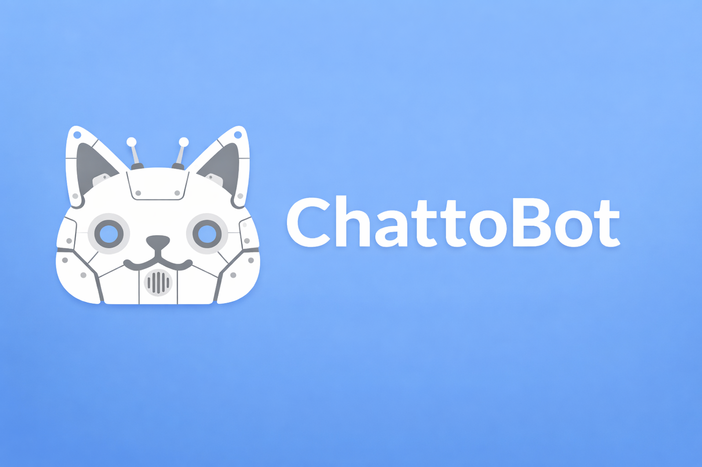

# ChattoBot

<p align="center">
  
</p>

Python bot framework for [Chatto](https://chatto.run). Decorator-based commands, discord.py-style cogs, WebSocket subscriptions, auto-reconnect, and typed argument parsing.

## Quick Start

```bash
pip install -e .
```

Set your session cookie:

```bash
export CHATTO_SESSION="your-session-cookie"
```

Write a bot:

```python
from chatto_bot import Bot, Context

bot = Bot(
    instance="https://dev.chatto.run",
    spaces=["SjH0ry5SFndJrZy"],
    prefix="!",
)

@bot.command(desc="Check if the bot is alive")
async def ping(ctx: Context):
    await ctx.reply("Pong!")

@bot.middleware
async def ignore_self(ctx, next):
    if ctx.actor and bot.user and ctx.actor.id != bot.user.id:
        await next()

bot.run()
```

## Features

- **Decorator-based commands** with typed argument parsing from type hints
- **Event handlers** for reacting to any event type (`message_posted`, `reaction_added`, etc.)
- **Cog system** for grouping related commands and handlers into loadable extensions
- **Middleware chain** for cross-cutting concerns (logging, ignoring self, permissions)
- **WebSocket subscriptions** with auto-reconnect and exponential backoff
- **Missed event replay** on startup (up to 1 hour of history)
- **Cookie-based auth** via `CHATTO_SESSION` env var (`.env` file supported)
- **Graceful shutdown** on SIGINT/SIGTERM/SIGHUP with state persistence

## Commands

```python
@bot.command(desc="Roll dice", aliases=["r"])
async def roll(ctx: Context, sides: int = 6):
    """Arguments are parsed from type hints."""
    await ctx.reply(f"Rolled: {random.randint(1, sides)}")
```

## Events

```python
@bot.on_event("message_posted")
async def on_message(ctx: Context):
    if ctx.body and "hello" in ctx.body.lower():
        await ctx.react("👋")
```

## Cogs

```python
from chatto_bot import Cog, command, on_event

class Greeter(Cog):
    @command(desc="Say hello")
    async def hello(self, ctx: Context):
        await ctx.reply(f"Hello, {ctx.actor.display_name}!")

    @on_event("user_joined_room")
    async def on_join(self, ctx: Context):
        await ctx.reply("Welcome!")

    async def cog_load(self):
        print("Greeter loaded")

async def setup(bot):
    await bot.add_cog(Greeter(bot))
```

Load extensions dynamically:

```python
await bot.load_extension("plugins.greeter")
await bot.reload_extension("plugins.greeter")  # hot reload
```

## Middleware

```python
@bot.middleware
async def log_commands(ctx, next):
    print(f"{ctx.actor.login}: {ctx.body}")
    await next()
```

## Configuration

Environment variables (or `.env` file):

| Variable | Description |
|----------|-------------|
| `CHATTO_SESSION` | Session cookie value (required) |
| `CHATTO_INSTANCE` | Instance URL (default: `https://dev.chatto.run`) |
| `CHATTO_PREFIX` | Command prefix (default: `!`) |

Or pass everything programmatically to `Bot(...)`.

## License

[AGPL-3.0-or-later](LICENSE)
