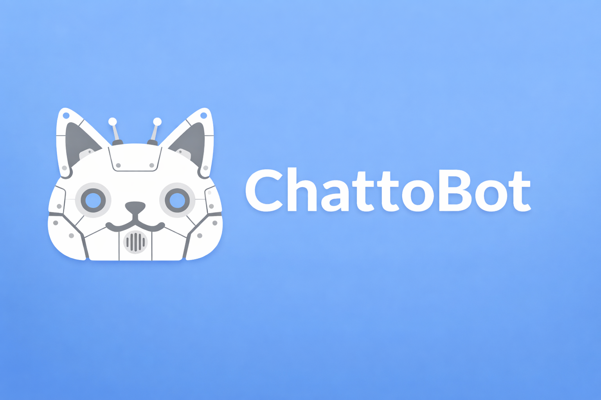

# ChattoBot

<p align="center">
  
</p>

Python bot framework for [Chatto](https://chatto.run). Decorator-based commands, discord.py-style cogs, a realtime event stream with auto-reconnect, and typed argument parsing.

## Quick Start

```bash
pip install -e .
```

Set the bot's credentials (exchanged for a bearer token at startup):

```bash
export CHATTO_EMAIL="bot@example.com"
export CHATTO_PASSWORD="..."
```

Or set `CHATTO_TOKEN` directly if you already have a token.

Write a bot:

```python
from chatto_bot import Bot, Context

bot = Bot(
    instance="https://chat.chatto.run",
    prefix="!",
)

@bot.command(desc="Check if the bot is alive")
async def ping(ctx: Context):
    await ctx.reply("Pong!")

bot.run()
```

## Features

- Decorator-based commands with typed argument parsing from type hints
- Commands trigger on the prefix (`!ping`) or an @mention of the bot (`@BotName ping`)
- Event handlers for any event type (`message_posted`, `reaction_added`, ...)
- Cogs for grouping commands and handlers into loadable extensions
- Middleware chain for cross-cutting concerns (logging, self-ignoring, permissions)
- Realtime event stream over a protobuf WebSocket, with auto-reconnect and backoff
- Reconnect catch-up replays up to an hour of missed events
- Bearer-token auth (email/password or `CHATTO_TOKEN`), with a session-cookie fallback
- Graceful shutdown on SIGINT/SIGTERM/SIGHUP with state persistence

## Commands

```python
@bot.command(desc="Roll dice", aliases=["r"])
async def roll(ctx: Context, sides: int = 6):
    """Arguments are parsed from type hints."""
    await ctx.reply(f"Rolled: {random.randint(1, sides)}")
```

## Events

```python
@bot.on_event("message_posted")
async def on_message(ctx: Context):
    if ctx.body and "hello" in ctx.body.lower():
        await ctx.react("wave")  # reactions take emoji shortcodes, not unicode
```

## Cogs

```python
from chatto_bot import Cog, command, on_event

class Greeter(Cog):
    @command(desc="Say hello")
    async def hello(self, ctx: Context):
        await ctx.reply(f"Hello, {ctx.actor.display_name}!")

    @on_event("user_joined_room")
    async def on_join(self, ctx: Context):
        await ctx.reply("Welcome!")

    async def cog_load(self):
        print("Greeter loaded")

async def setup(bot):
    await bot.add_cog(Greeter(bot))
```

Load extensions dynamically:

```python
await bot.load_extension("plugins.greeter")
await bot.reload_extension("plugins.greeter")  # hot reload
```

## Middleware

```python
@bot.middleware
async def log_commands(ctx, next):
    print(f"{ctx.actor.login}: {ctx.body}")
    await next()
```

## Configuration

Three sources, in order of precedence: explicit kwargs to `Bot(...)`, environment variables (and `.env`), then a YAML file.

Environment variables:

| Variable | Description |
|----------|-------------|
| `CHATTO_TOKEN` | Bearer token. Skips login when set. |
| `CHATTO_EMAIL` / `CHATTO_PASSWORD` | Login credentials. The bot exchanges them for a bearer token at startup. |
| `CHATTO_SESSION` | Session cookie, used as an auth fallback. |
| `CHATTO_INSTANCE` | Instance URL (default: `https://dev.chatto.run`). |
| `CHATTO_PREFIX` | Command prefix (default: `!`). |
| `CHATTO_ROOMS` | Comma-separated allowlist of room IDs. Empty = all rooms. |
| `CHATTO_ADMINS` | Comma-separated login names allowed to invoke `admin=True` commands. |
| `CHATTO_DMS` | `false` / `0` / `no` disables DM handling. Default: enabled. |

YAML config (pass via `Bot(config_path="chatto-bot.yaml")`):

```yaml
instance: https://chat.chatto.run
prefix: "!"
dms: true

admins:
  - alice
  - bob

extensions:
  - plugins.admin
  - plugins.remind
```

Keep secrets (`token`, `session`, `email`, `password`) out of YAML. Use `.env` or environment variables instead.

## License

[AGPL-3.0-or-later](LICENSE)
